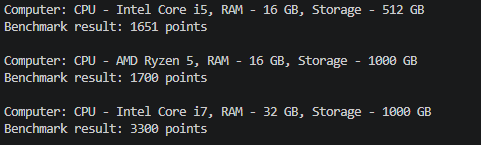

# Лабораторна робота №1. Створення першого проєкту. Класи та об’єкти

**Студент:** Залужний Олег
**Група:** КН 3/1
**Варіант:** №10 (Клас Computer)  

---

# Про проєкт
Проста консольна програма на C# (.NET), яка демонструє основи ООП на прикладі класу Computer. Вона описує характеристики ПК та вміє перевіряти його швидкість.

# Що містить клас Computer (Варіант 10)
Приватні дані: cpu (назва процесора) та ram (обсяг оперативної пам'яті).

Публічні дані: Storage (обсяг накопичувача).

Конструктор: заповнює характеристики комп'ютера при його створенні.

Метод RunBenchmark(): запускає тест продуктивності та показує результат на екрані.

---

## Як запустити проєкт

1. Клонувати репозиторій:
   ```bash
   git clone https://github.com/zaluzhnyiovkn24-ship-it/OOP-ZALUZHNYI/tree/main/lab1v10

---
## Приклад
