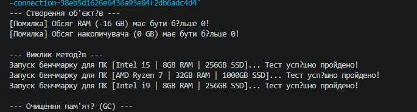

# Лабораторна робота №2 (Варіант 10)

# Лабораторна робота №2. Перевантаження конструкторів та життєвий цикл об'єкта

**Студент:** Залужний Олег
**Група:** КН 3/1  
**Варіант:** №10 (Клас Computer)  

# Про проєкт
У цій лабораторній роботі вдосконалено клас Computer: додано перевірку введених даних, кілька способів створення об'єкта та очищення пам'яті.

# Що реалізовано
Кілька конструкторів (: this()): дозволяють створювати комп'ютер з різним набором даних, викликаючи один конструктор з іншого.

Захист від помилок: властивості RAM та Storage перевіряють значення і не дозволяють вказувати нуль або від'ємні числа.

Деструктор та GC.Collect(): демонструють, як C# видаляє непотрібні об'єкти з пам'яті.

Перевірка в Main: створено 3 об'єкти ПК різними способами, протестовано захист даних та запуск збирача сміття.

## Як запустити проєкт
1. Клонувати репозиторій:
   ```bash
   git clone 

---
## Приклад 
