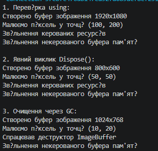

# Лабораторна робота №3. Життєвий цикл об’єкта та керування ресурсами

**Студент:** Залужний Олег
**Група:** КН 3/1 
**Варіант:** №10 (Клас ImageBuffer)  

---

# Про проєкт
У цій лабораторній роботі створено клас ImageBuffer, який показує, як правильно вивантажувати з пам'яті важкі дані та очищати ресурси в C# за допомогою інтерфейсу IDisposable.

# Три способи очищення ресурсів у програмі
Автоматичний через using: пам'ять звільняється сама одразу після завершення роботи з об'єктом.

Ручний через Dispose(): прямий виклик методу очищення в потрібний момент.

Фоновий через фіналізатор (GC.Collect()): примусовий запуск збирача сміття, який очищає забуті ресурси.

---

## Як запустити проєкт

1. Клонувати репозиторій:
   ```bash
   git clone https://github.com/zaluzhnyiovkn24-ship-it/OOP-ZALUZHNYI/tree/main/lab3v10

---
## Приклад
